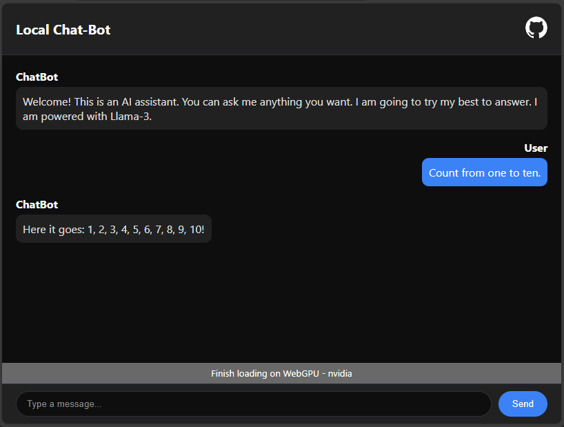

# Web-LLM Chatbot

This is a simple HTML/JS/CSS template for a ChatGPT-like chatbot using the Web-LLM library and Llama-3 8B.

## Features

- **Local Processing**: Runs entirely in your browser, ensuring the privacy.
- **Llama-3 8B**: Open source AI generative model.

## Usage

To use the chatbot, simply type a message into the input field and press Enter. The chatbot will then generate a response based on your input.

## **Important Note:**
Obviusly visit https://webgpureport.org/ first to know if your browser supports WebGPU. If not, try checking if you can enable it if you have a correct version of your browser or try another one.
This chatbot runs locally in your browser using your GPU as a main source of computation the vram required can be as high as 5295.7 on this model. Please be mindful of your PC's resources.
However, if you're looking for more options, you can check out the full list of available models on the [Web-LLM repo](https://github.com/mlc-ai/web-llm) and swap them out as needed.

## Credits

- [Web-LLM library](https://github.com/mlc-ai/web-llm)
- [midudev](https://www.youtube.com/@midudev) for teaching us how to do this in the first place
